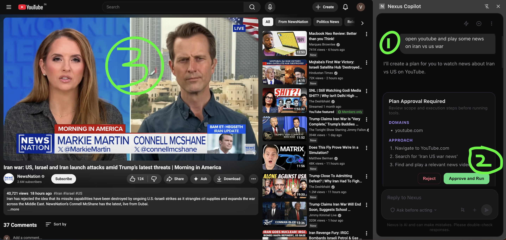

# Browser Copilot

AI browser automation copilot — a Chrome extension (Svelte 5 + Vite) with a streaming Node.js backend. Uses the `openai` npm package, so it works with any OpenAI-compatible provider (HuggingFace, xAI, OpenRouter, etc.).



> **1** — Type your task in the side panel. **2** — Approve the plan (or enable auto-approve). **3** — Watch the agent automate your browser in real time.

## Features

- Streaming chat loop between extension and backend (tool calls + tool results)
- Planning gate via `update_plan` — approve before tool execution
- Browser automation tools: read page, find elements, form input, computer controls, navigation, screenshots
- Debug tools: console logs + network request capture
- Session persistence and restore
- One-click quick workflow prompts
- Transcript export (Markdown copy + JSON download)
- Tools: `extract_links`, `get_selected_text`, `page_snapshot`, `tabs_activate`, `tabs_close`

## Project layout

```
browser-copilot/
├── extension/   # Chrome extension (Svelte 5 + Vite, Manifest V3)
├── backend/     # Node.js local server + AWS Lambda streaming endpoint
└── ccc.json     # Reference API trace (request/response format)
```

## Prerequisites

- **Node.js** v18+ (v20 recommended)
- **npm** v9+
- **Google Chrome** v116+
- An API key from any OpenAI-compatible provider (HuggingFace, OpenRouter, xAI, etc.)

## Run locally

### 1. Start the backend

```bash
cd backend
npm install
cp .env.example .env   # then edit .env with your API key
npm run dev
```

The server starts on `http://localhost:3001`.

#### Environment variables

| Variable | Required | Default | Description |
|---|---|---|---|
| `LLM_API_KEY` | Yes | — | API key for your LLM provider |
| `LLM_BASE_URL` | No | `https://router.huggingface.co/v1` | OpenAI-compatible API base URL |
| `LLM_MODEL` | No | `zai-org/GLM-5:zai-org` | Model name |
| `PORT` | No | `3001` | Local server port |

### 2. Build and load the extension

```bash
cd extension
npm install
npm run build
```

Then load it in Chrome:

1. Go to `chrome://extensions`
2. Enable **Developer mode** (top-right toggle)
3. Click **Load unpacked**
4. Select the `extension/dist` folder

> **Tip:** During development, use `npm run dev` instead of `npm run build` for automatic rebuilds on file changes. Reload the extension in Chrome after each rebuild.

### 3. Use the copilot

1. Click the Browser Copilot icon in the Chrome toolbar to open the side panel (or press `Cmd+E` on Mac / `Ctrl+E` on Windows)
2. Open **Settings** and confirm the Backend URL is `http://localhost:3001`
3. Type a task or click a quick workflow prompt
4. Review and approve the plan when shown
5. The agent executes browser tools and streams responses in real time

## Deploy backend to AWS (optional)

```bash
cd backend
npm run deploy
```

Then update the **Backend URL** in the extension settings to your API Gateway / Lambda Function URL.
